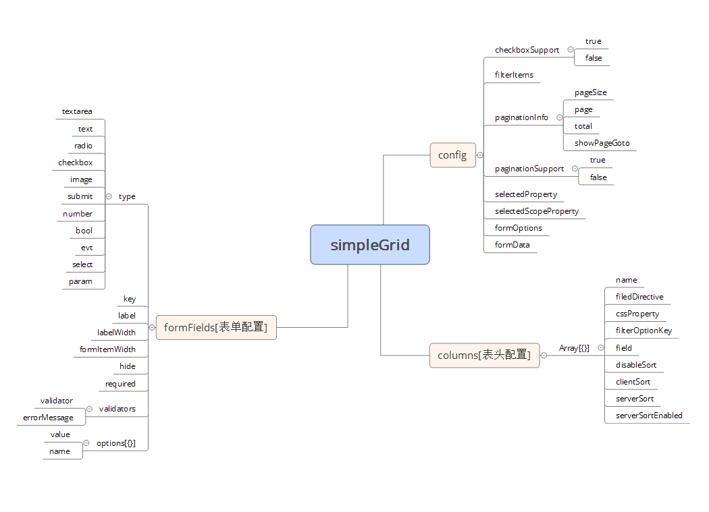

# ng1-setting（配置列表）

- 【ng1-setting（配置列表）】：这是一个 ng1 指令配置列表案例，前端基于Angular 1.4.0 + ng-Bootstrap。

ng1-setting 可以用来搭建后台配置站点，或者用于学习Angular（其实我并不在乎你用来干嘛，那关我什么事呢对吧？）。

## 业务组件

-  `simple-form` [配置参数案例]('./src/app/list/model/user-defined-config.js')

## 用法

用git克隆本项目，从命令行进入进入项目根目录，依次执行以下命令：

	npm i -g cnpm
	cnpm install
	npm start

如果你之前已经尝试安装过node模块，请把ng1-setting根目录下的node_moduels目录删掉
然后依次执行以下命令：

	npm cache clean
	npm i -g cnpm
	cnpm install
	ng start

打开你的浏览器，访问http://localhost:3000/

## 开源许可证
 MIT

